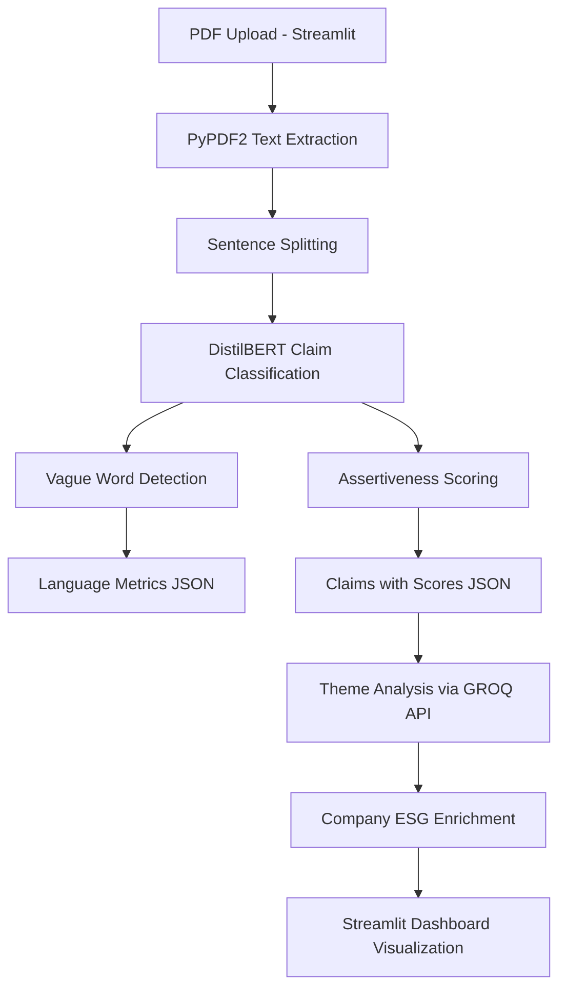

# ESG Report  Environment Analyzer — Project Overview

[](https://www.python.org/)
[](https://streamlit.io/)
[](https://huggingface.co/distilbert-base-uncased)

An end-to-end NLP pipeline designed to extract, classify, and score about environmental claims within ESG (Environmental, Social, and Governance) reports. This tool helps analysts identify specific sustainability commitments, filter out "vague" language, and score the assertiveness of corporate claims.


---

## 🛠 Tech Stack
* **Frontend:** Streamlit
* **NLP Models:** DistilBERT (Claim Classification), Custom Regex (Vague Word Detection)
* **PDF Processing:** PyPDF2
* **API Integration:** GROQ API (for accuracy verification)
* **Metrics:** Readability (textstat), Assertiveness Scoring

---

## ⚙️ Installation & Setup

### 1. Environment Setup
We recommend using a virtual environment to manage dependencies:

```powershell
python -m venv .venv
# Activate on Windows:
.\.venv\Scripts\Activate.ps1
# Activate on Mac/Linux:
source .venv/bin/activate
```
## High-level flow:
- `frontend.py`: Streamlit UI — uploads a PDF and invokes the extractor.
- `claims_extractor/run_pdf_claims_extractor.py`: orchestrates PDF reading, sentence splitting, claim detection and language metrics; writes `claims_extractor/claims.json` and `claims_extractor/scores.json`.
- `claim_classifier/` : Contains the model to extract the input from the PDF.
- `claim_scorer/assertiveness.py`: Reads `claims_extractor/claims.json`, computes assertiveness/claim type, and writes `claim_scorer/claims_with_scores.json`.
- `claimtoclassify/` : Contains files to organizes the claims to different types.
- `claimtoclassify/sum_class.py` :  Organizes the different claims.
- `claimtoclassify/summarizer_to_claims.py` : Picks the Top-5 numeric claims.
- `run_pipeline_Unilever.py`: (Optional) Example Streamlit dashboard that consumes precomputed Unilever JSON outputs for visualization.

## Key components (what to look at):
- `claims_extractor/` : PDF -> text (`pdf_reader.py`), sentence splitting (`sentence_splitter.py`), claim classifier wrapper (`extract_claims.py`), vague-word scoring (`vague_words.py`), readability (`readablity.py`), and runner (`run_pdf_claims_extractor.py`).
- `claim_classifier/` : saved DistilBERT model and tokenizer used by `extract_claims.py`.
- `claim_scorer/` : post-processing scripts (`assertiveness.py`) that add `assertiveness_score` and `claim_type`.
- `document/` : Contains the documents necessary for the working.
- `analyze/` : Contains the files to use GROQ api, and help in verification. (`getting_accuracy.py`) Helps in checking the claims, (`scrapper.py`) gives the data of the company.
- `Unilever/` : This will be used for any backup. Data of Unilever

**Setup**

1. Install dependencies (uses `requirements.txt`):

```powershell
python -m pip install -r requirements.txt
```

2. (Optional) If you see `ModuleNotFoundError: No module named 'PyPDF2'` or similar, install into the same Python used to run the pipeline:

```powershell
python -m pip install PyPDF2 textstat transformers torch
```

**Running**
- Start the interactive uploader (recommended):

```powershell
streamlit run frontend.py
```

- Or run the extractor directly on a PDF:

```powershell
python claims_extractor/run_pdf_claims_extractor.py path\to\report.pdf
```

- To run scoring after extraction:

```powershell
python claim_scorer/assertiveness.py
```

- To view the example Unilever dashboard:

```powershell
streamlit run run_pipeline_Unilever.py
```

**Notes & Troubleshooting**
- Environment mismatch: `streamlit` may run under a different Python than your `pip` installs. To ensure the same interpreter is used, either install packages into the interpreter used by Streamlit, or modify `frontend.py` to call the extractor with `sys.executable`:

```python
import sys
subprocess.run([sys.executable, "claims_extractor/run_pdf_claims_extractor.py", temp_pdf_path])
```

- Missing model files: `claim_classifier/` should contain the DistilBERT weights and tokenizer. If missing, run `document/model.py` to train and save the model (requires GPU for speed).
- Large ML dependencies: `torch` and `transformers` are heavy. If you only need extraction without classification, you can stub `extract_claims.is_claim()` to avoid loading the model.
- If PDF text extraction returns empty/low-quality text, try different PDF sources or check if the PDF is image-scanned (requires OCR — not included).


## 🏗 System Architecture




**File map (concise)**
- `frontend.py` — Streamlit uploader and runner.
- `claims_extractor/run_pdf_claims_extractor.py` — CLI entry to extract claims from a PDF.
- `claims_extractor/pdf_reader.py` — uses `PyPDF2` to extract raw text.
- `claims_extractor/sentence_splitter.py` — simple regex-based sentence splitter.
- `claims_extractor/extract_claims.py` — wrapper that loads `claim_classifier` and runs DistilBERT.
- `claims_extractor/vague_words.py` & `readablity.py` — language quality metrics.
- `claim_scorer/assertiveness.py` — scoring and claim-type classification.
- `document/model.py` — dataset loader and DistilBERT training script.

---

